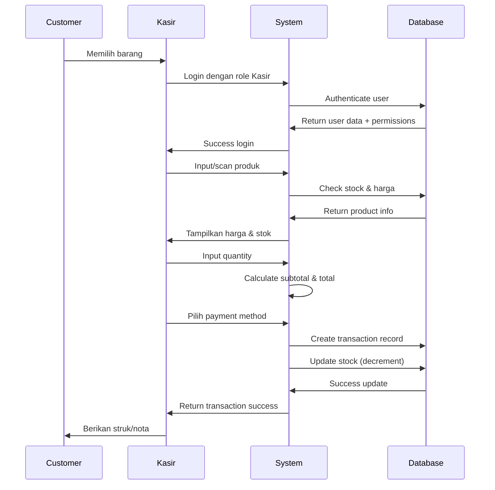
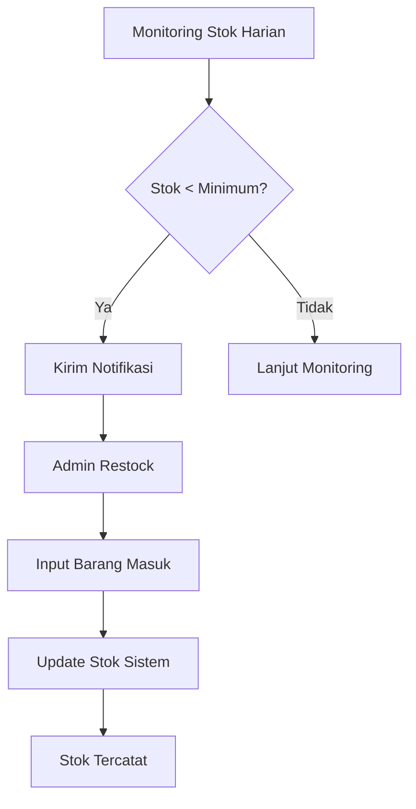

# 🏪 Warung Keuangan API - Backend System

[](https://laravel.com)
[](https://flutter.dev)
[](https://mysql.com)
[](https://restfulapi.net)

Backend API sistem pencatatan keuangan warung modern dengan Laravel Sanctum authentication dan role-based authorization menggunakan Spatie Permission.

## 📋 Daftar Isi

- [Fitur Utama](#-fitur-utama)
- [Proses Bisnis](#-proses-bisnis)
- [Tech Stack](#-tech-stack)
- [Struktur Project](#-struktur-project)
- [Installation](#-installation)
- [API Documentation](#-api-documentation)
- [Database Schema](#-database-schema)
- [Role & Permission](#-role--permission)
- [Testing](#-testing)
- [Deployment](#-deployment)
- [Contributing](#-contributing)

## 🚀 Fitur Utama

### 🔐 Authentication & Authorization
- **Laravel Sanctum** untuk API authentication
- **Spatie Permission** untuk role-based access control
- Multi-role system (Admin, Kasir)
- Secure token management

### 💰 Transaction Management
- ✅ **Pencatatan Penjualan** (Income)
- 📤 **Pencatatan Pengeluaran** (Expense)
- 💳 **Multi Payment Method** (Cash, Transfer, QRIS)
- 🔄 **Stock Management** otomatis
- 📦 **Real-time inventory tracking**

### 📊 Reporting & Analytics
- 📈 **Dashboard** ringkasan keuangan
- 📅 **Laporan Harian/Bulanan**
- 📊 **Profit/Loss analysis**
- 📉 **Stock movement reports**

### 🛍️ Product Management
- 🏷️ **Kategori produk**
- 📋 **CRUD produk lengkap**
- ⚠️ **Low stock alerts**
- 🔍 **Product search & filter**

## 📊 Proses Bisnis

### 🔄 Alur Transaksi Penjualan


### 📦 Alur Management Stok


### 👥 Role & Workflow

#### 🎯 Role: Admin
- **Full system access**
- Kelola user & permissions
- Monitoring semua transaksi
- Generate laporan lengkap
- Management produk & kategori

#### 🎯 Role: Kasir  
- **Transaction processing only**
- Input penjualan harian
- Lihat stok produk
- Akses laporan terbatas
- Tidak bisa hapus transaksi

## 🛠 Tech Stack

### Backend
- **Laravel 10** - PHP Framework
- **Laravel Sanctum** - API Authentication
- **Spatie Permission** - Role Management
- **MySQL** - Database
- **PHPUnit** - Testing

### Frontend (Future)
- **Flutter** - Mobile Framework
- **BLoC** - State Management
- **Dio** - HTTP Client
- **Hive** - Local Storage

## 📁 Struktur Project

```
warung-keuangan-api/
├── app/
│   ├── Http/
│   │   ├── Controllers/
│   │   │   └── Api/
│   │   │       └── V1/
│   │   │           ├── AuthController.php
│   │   │           ├── TransactionController.php
│   │   │           ├── ProductController.php
│   │   │           ├── CategoryController.php
│   │   │           ├── DashboardController.php
│   │   │           └── ReportController.php
│   │   ├── Middleware/
│   │   └── Requests/
│   ├── Models/
│   │   ├── User.php
│   │   ├── Transaction.php
│   │   ├── Product.php
│   │   ├── Category.php
│   │   └── TransactionDetail.php
│   ├── Policies/
│   │   ├── TransactionPolicy.php
│   │   └── ProductPolicy.php
│   └── Providers/
├── database/
│   ├── migrations/
│   └── seeders/
├── routes/
│   └── api.php
└── config/
```

## ⚙️ Installation

### Prerequisites
- PHP 8.1+
- Composer
- MySQL 5.7+
- Laravel 10

### Step 1: Clone Repository
```bash
git clone https://github.com/your-username/warung-keuangan-api.git
cd warung-keuangan-api
```

### Step 2: Install Dependencies
```bash
composer install
```

### Step 3: Environment Configuration
```bash
cp .env.example .env
php artisan key:generate
```

Edit `.env` file:
```env
DB_CONNECTION=mysql
DB_HOST=127.0.0.1
DB_PORT=3306
DB_DATABASE=warung_keuangan
DB_USERNAME=your_username
DB_PASSWORD=your_password

APP_URL=http://localhost:8000
FRONTEND_URL=http://localhost:3000
```

### Step 4: Database Setup
```bash
# Run migrations
php artisan migrate

# Seed initial data
php artisan db:seed --class=RolePermissionSeeder
php artisan db:seed --class=UserSeeder
php artisan db:seed --class=CategorySeeder
php artisan db:seed --class=ProductSeeder

# Or seed all
php artisan db:seed
```

### Step 5: Serve Application
```bash
# Development server
php artisan serve

# Or production setup
php artisan config:cache
php artisan route:cache
php artisan optimize
```

### Step 6: Testing (Optional)
```bash
# Run tests
php artisan test

# Generate test coverage
php artisan test --coverage
```

## 📚 API Documentation

### Authentication Endpoints

#### 🔐 Login
```http
POST /api/login
Content-Type: application/json

{
  "email": "admin@warung.com",
  "password": "password123"
}
```

Response:
```json
{
  "user": {
    "id": 1,
    "name": "Admin Warung",
    "email": "admin@warung.com",
    "roles": ["admin"]
  },
  "token": "1|randomtoken123"
}
```

#### 🔐 Register (Admin Only)
```http
POST /api/register
Content-Type: application/json
Authorization: Bearer {token}

{
  "name": "Kasir Baru",
  "email": "kasir@warung.com",
  "password": "password123",
  "password_confirmation": "password123",
  "phone": "081234567890"
}
```

### Transaction Endpoints

#### 🛒 Create Transaction
```http
POST /api/transactions
Content-Type: application/json
Authorization: Bearer {token}

{
  "type": "income",
  "payment_method": "cash",
  "description": "Penjualan harian",
  "transaction_date": "2024-01-15 10:30:00",
  "items": [
    {
      "product_id": 1,
      "quantity": 2
    },
    {
      "product_id": 3, 
      "quantity": 1
    }
  ]
}
```

#### 📋 Get Transactions
```http
GET /api/transactions?type=income&start_date=2024-01-01&end_date=2024-01-31
Authorization: Bearer {token}
```

### Product Endpoints

#### 📦 Get Products
```http
GET /api/products?low_stock=true&search=mie
Authorization: Bearer {token}
```

#### ➕ Create Product (Admin Only)
```http
POST /api/products
Content-Type: application/json
Authorization: Bearer {token}

{
  "category_id": 1,
  "name": "Indomie Goreng",
  "code": "IND-001",
  "price": 3500,
  "stock": 50,
  "min_stock": 10,
  "description": "Mie instan rasa goreng"
}
```

### Report Endpoints

#### 📊 Dashboard Summary
```http
GET /api/dashboard/summary
Authorization: Bearer {token}
```

Response:
```json
{
  "today_income": 1250000,
  "today_expense": 350000,
  "monthly_income": 28500000,
  "monthly_expense": 8500000,
  "low_stock_products": 5,
  "total_transactions": 45
}
```

#### 📈 Daily Report
```http
GET /api/reports/daily?date=2024-01-15
Authorization: Bearer {token}
```

## 🗃 Database Schema

### Users Table
```sql
users
├── id (PK)
├── name
├── email
├── password
├── phone
├── email_verified_at
└── timestamps
```

### Transactions Table
```sql
transactions
├── id (PK)
├── user_id (FK → users)
├── code (UNIQUE)
├── type (enum: income, expense)
├── total_amount (decimal)
├── payment_method (enum: cash, transfer, qris)
├── description
├── transaction_date
└── timestamps
```

### Products Table
```sql
products
├── id (PK) 
├── category_id (FK → categories)
├── name
├── code (UNIQUE)
├── price (decimal)
├── stock (integer)
├── min_stock (integer)
├── description
└── timestamps
```

### Transaction Details Table
```sql
transaction_details
├── id (PK)
├── transaction_id (FK → transactions)
├── product_id (FK → products)
├── quantity (integer)
├── price (decimal)
├── subtotal (decimal)
└── timestamps
```

## 👥 Role & Permission

### Default Roles & Permissions

#### 🎯 Admin Role
```php
Permissions: [
    'user.manage',
    'transaction.view',
    'transaction.create', 
    'transaction.update',
    'transaction.delete',
    'product.manage',
    'category.manage',
    'report.view',
    'dashboard.view'
]
```

#### 🎯 Kasir Role
```php
Permissions: [
    'transaction.create',
    'transaction.view',
    'product.view'
]
```

### Default Users

| Email | Password | Role | Permissions |
|-------|----------|------|-------------|
| `admin@warung.com` | `password123` | Admin | Full access |
| `kasir@warung.com` | `password123` | Kasir | Limited access |

## 🧪 Testing

### Run Test Suite
```bash
# Run all tests
php artisan test

# Run specific test
php artisan test --filter TransactionTest

# Test with coverage
php artisan test --coverage-html coverage/
```

### Example Test Case
```php
public function test_kasir_can_create_transaction()
{
    $user = User::factory()->create();
    $user->assignRole('kasir');
    
    $product = Product::factory()->create(['stock' => 10]);
    
    $response = $this->actingAs($user)
        ->postJson('/api/transactions', [
            'type' => 'income',
            'payment_method' => 'cash',
            'items' => [
                ['product_id' => $product->id, 'quantity' => 2]
            ]
        ]);
    
    $response->assertStatus(201);
    $this->assertEquals(8, $product->fresh()->stock); // Stock berkurang 2
}
```

## 🚀 Deployment

### Production Setup
```bash
# Environment setup
cp .env.example .env
# Edit .env for production values

# Install dependencies
composer install --optimize-autoloader --no-dev

# Database setup
php artisan migrate --force
php artisan db:seed --force

# Optimization
php artisan config:cache
php artisan route:cache
php artisan view:cache

# Storage link
php artisan storage:link
```

### Server Requirements
- PHP 8.1+
- MySQL 5.7+ / PostgreSQL
- Web server (Apache/Nginx)
- SSL Certificate (recommended)

### Environment Variables
```env
APP_ENV=production
APP_DEBUG=false
APP_URL=https://yourdomain.com

DB_CONNECTION=mysql
DB_HOST=127.0.0.1
DB_PORT=3306
DB_DATABASE=warung_keuangan
DB_USERNAME=username
DB_PASSWORD=password

SANCTUM_STATEFUL_DOMAINS=yourdomain.com,localhost:3000
```

## 🤝 Contributing

We welcome contributions! Please follow these steps:

### Development Workflow
1. Fork the repository
2. Create feature branch: `git checkout -b feature/amazing-feature`
3. Commit changes: `git commit -m 'Add amazing feature'`
4. Push to branch: `git push origin feature/amazing-feature`
5. Open Pull Request

### Coding Standards
- Follow PSR-12 coding standards
- Write tests for new features
- Update documentation accordingly
- Use meaningful commit messages

### Issue Reporting
- Use the GitHub issue tracker
- Describe the bug or feature request clearly
- Include steps to reproduce (for bugs)
- Add screenshots if applicable

## 📄 License

This project is licensed under the MIT License - see the [LICENSE](LICENSE) file for details.

## 👨‍💻 Developers

- **Your Name** - [GitHub Profile](https://github.com/your-username)
- **Email** - your.email@example.com

## 🙏 Acknowledgments

- Laravel Framework
- Spatie Permission Package
- Flutter Team
- All contributors and testers

---

## 📞 Support

Jika Anda membutuhkan bantuan atau memiliki pertanyaan:

- 📧 **Email**: support@warungkeuangan.com
- 🐛 **Issues**: [GitHub Issues](https://github.com/your-username/warung-keuangan-api/issues)
- 📚 **Documentation**: [Wiki](https://github.com/your-username/warung-keuangan-api/wiki)

---

<div align="center">

**⭐ Don't forget to star this repository if you find it helpful!**

</div>
